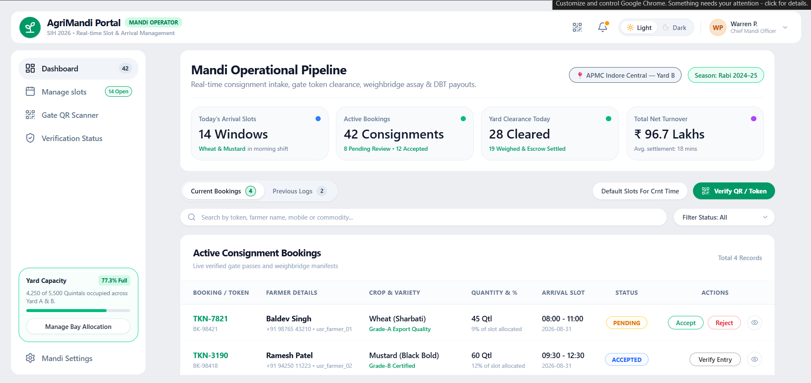
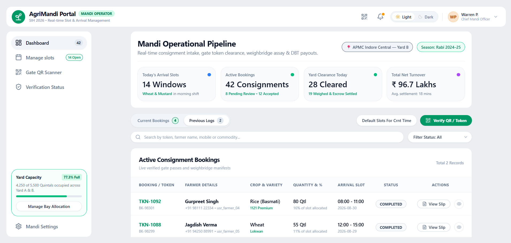

why mandi operation pipeline is rerendering when i click previous logs to curent logs also notice the the diffrence in active assignment booking analyse i tfrom the given sscreen shots and fix that  

 bro consider the the boldnes of this image and fix it everywhere for example in mandislot managemandi arivalsslot is more bold compare to given image 